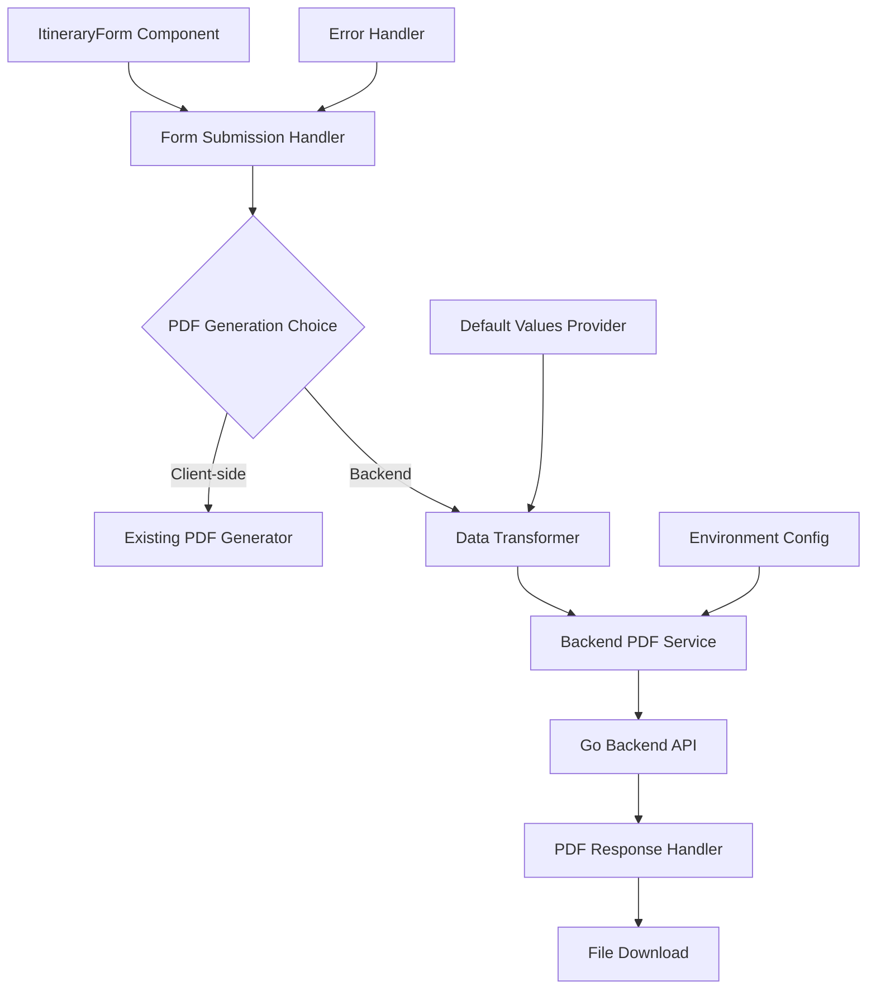

# Design Document

## Overview

This design implements a backend integration layer for the existing itinerary form, enabling dual PDF generation capabilities (client-side and backend API). The solution focuses on data transformation, error handling, and maintaining user experience consistency while adding new backend functionality.

## Architecture

### High-Level Architecture



### Data Flow

1. **Form Submission**: User completes form and selects PDF generation method
2. **Data Transformation**: Frontend data is transformed to backend format with defaults
3. **API Communication**: Transformed data is sent to Go backend via HTTP POST
4. **Response Handling**: Backend response is processed and PDF is downloaded
5. **Error Management**: Any errors are caught and displayed with fallback options

## Components and Interfaces

### 1. Data Transformer (`src/lib/dataTransformer.ts`)

**Purpose**: Convert frontend ItineraryFormData to backend ItineraryRequest format

**Key Functions**:

```typescript
interface DataTransformer {
  transformToBackendFormat(frontendData: ItineraryFormData): ItineraryRequest;
  generateDefaultValues(): Partial<ItineraryRequest>;
  calculateDuration(startDate: string, endDate: string): string;
  transformActivities(activities: Activity[]): BackendActivity[];
  transformFlights(days: Day[]): BackendFlight[];
}
```

**Transformation Mapping**:

- `customerName/Email/Phone` → `customer: {name, email, phone}`
- `tripTitle/destination/etc` → `trip: {title, destination, duration, travelers, departureFrom}`
- `days[].activities` → `itinerary.days[].activities` (with added type/time fields)
- `days[].transfers` → `itinerary.days[].transfers` (direct mapping)
- `days[].flights` → Extract to top-level `flights` array with date mapping

### 2. Backend PDF Service (`src/lib/backendPdfService.ts`)

**Purpose**: Handle communication with Go backend API

**Key Functions**:

```typescript
interface BackendPdfService {
  generatePDF(data: ItineraryRequest): Promise<Blob>;
  getBackendUrl(): string;
  handleApiResponse(response: Response): Promise<Blob>;
  downloadPdf(blob: Blob, filename: string): void;
}
```

**Configuration**:

- Environment variable: `NEXT_PUBLIC_BACKEND_URL` (default: `http://localhost:8080`)
- API endpoint: `/api/v1/generate-pdf`
- Request method: POST with JSON payload

### 3. Enhanced Form Component (`src/components/form/ItineraryForm.tsx`)

**Purpose**: Add backend PDF generation option to existing form

**New State Variables**:

```typescript
const [isGeneratingBackend, setIsGeneratingBackend] = useState(false);
const [backendError, setBackendError] = useState<string | null>(null);
```

**New UI Elements**:

- Two separate buttons for PDF generation methods
- Backend-specific loading states and error messages
- Fallback suggestions when backend fails

### 4. Default Values Provider (`src/lib/defaultValues.ts`)

**Purpose**: Provide comprehensive default values for backend-specific fields

**Default Structures**:

```typescript
interface DefaultValues {
  payment: Payment;
  config: PDFConfig;
  companyInfo: CompanyInfo;
  importantNotes: ImportantNote[];
  scopeOfService: ServiceScope[];
  inclusions: Inclusion[];
  visaDetails: VisaDetails;
}
```

## Data Models

### Frontend to Backend Mapping

**Customer Transformation**:

```typescript
// Frontend
{ customerName: string, customerEmail: string, customerPhone: string }

// Backend
{ customer: { name: string, email: string, phone: string } }
```

**Trip Transformation**:

```typescript
// Frontend
{ tripTitle: string, destination: string, startDate: string, endDate: string, numberOfTravellers: number }

// Backend
{
  trip: {
    title: string,
    destination: string,
    startDate: string,
    endDate: string,
    duration: string, // Calculated: "X Days Y Nights"
    travelers: number,
    departureFrom: string // Default or derived
  }
}
```

**Activity Enhancement**:

```typescript
// Frontend Activity
{ id, name, description, price, duration, image, location }

// Backend Activity (enhanced)
{
  id, name, description, location, duration, price, image,
  type: string, // Default: "sightseeing"
  time: string  // Default: "09:00"
}
```

**Flight Extraction**:

```typescript
// Frontend: flights nested in days
days[].flights[]

// Backend: flights at top level with date mapping
flights: [{ ...flightData, date: dayDate }]
```

## Error Handling

### Error Categories

1. **Network Errors**: Connection failures, timeouts
2. **Validation Errors**: Backend validation failures
3. **Server Errors**: Backend processing errors
4. **Client Errors**: Data transformation errors

### Error Handling Strategy

```typescript
interface ErrorHandler {
  handleNetworkError(error: Error): string;
  handleValidationError(errors: APIError[]): string;
  handleServerError(response: Response): string;
  suggestFallback(): void;
}
```

### User Experience

- Clear error messages with specific details
- Suggestion to try client-side generation as fallback
- Retry mechanisms for transient failures
- Progress indicators for long-running operations

## Testing Strategy

### Unit Tests

1. **Data Transformer Tests**:

   - Test all transformation mappings
   - Verify default value generation
   - Test edge cases and missing data

2. **Backend Service Tests**:

   - Mock API responses
   - Test error handling scenarios
   - Verify file download functionality

3. **Component Tests**:
   - Test dual button functionality
   - Verify loading states
   - Test error display

### Integration Tests

1. **End-to-End Flow**:

   - Complete form submission to PDF download
   - Error scenarios and recovery
   - Both generation methods working

2. **API Integration**:
   - Real backend API communication
   - Response handling verification
   - File download validation

### Test Data

- Sample form data covering all field types
- Edge cases: minimal data, maximum data
- Error scenarios: invalid data, network failures

## Implementation Considerations

### Performance

- Lazy loading of backend service
- Efficient data transformation
- Minimal bundle size impact

### Security

- Environment variable validation
- Input sanitization before API calls
- Secure file download handling

### Maintainability

- Clear separation of concerns
- Comprehensive error logging
- Type safety throughout

### Scalability

- Configurable backend endpoints
- Support for multiple PDF generation backends
- Extensible transformation system

## Configuration

### Environment Variables

```env
NEXT_PUBLIC_BACKEND_URL=http://localhost:8080
NEXT_PUBLIC_ENABLE_BACKEND_PDF=true
NEXT_PUBLIC_PDF_TIMEOUT=30000
```

### Default Values Configuration

All default values will be centralized in `defaultValues.ts` for easy maintenance and customization.

## Migration Strategy

1. **Phase 1**: Implement transformation layer and backend service
2. **Phase 2**: Add dual buttons to form component
3. **Phase 3**: Implement error handling and user feedback
4. **Phase 4**: Add comprehensive testing
5. **Phase 5**: Deploy with feature flag for gradual rollout
