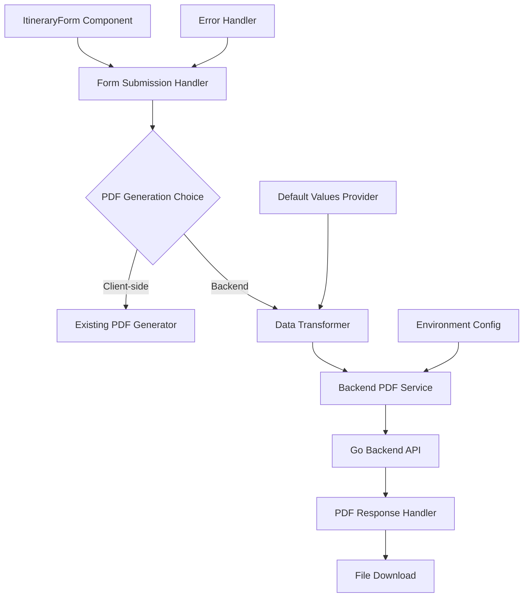

# Backend Integration Documentation

This document provides comprehensive information about the backend integration functionality for PDF generation in the itinerary application.

## Table of Contents

- [Overview](#overview)
- [Architecture](#architecture)
- [Components](#components)
- [Data Transformation](#data-transformation)
- [Error Handling](#error-handling)
- [Configuration](#configuration)
- [Usage Examples](#usage-examples)
- [Troubleshooting](#troubleshooting)
- [Developer Guide](#developer-guide)

## Overview

The backend integration feature enables the application to generate PDFs using a Go backend API while maintaining the existing client-side PDF generation capability. This provides users with two PDF generation options:

1. **Client-side PDF Generation**: Uses browser-based PDF generation (existing functionality)
2. **Backend PDF Generation**: Uses server-side Go API for PDF generation (new functionality)

### Key Features

- **Dual PDF Generation**: Both client-side and backend options available
- **Data Transformation**: Automatic conversion from frontend to backend data format
- **Comprehensive Error Handling**: Network, validation, and server error handling
- **Default Values**: Automatic injection of backend-specific default values
- **Retry Mechanism**: Automatic retry for transient failures
- **Health Monitoring**: Backend health checks and connectivity validation
- **Environment Configuration**: Flexible configuration for different environments

## Architecture

### High-Level Architecture



### Data Flow

1. **Form Submission**: User completes the itinerary form
2. **Method Selection**: User chooses between client-side or backend PDF generation
3. **Data Transformation**: Frontend data is transformed to backend format with defaults
4. **API Communication**: Transformed data is sent to Go backend via HTTP POST
5. **Response Processing**: Backend response is processed and validated
6. **File Download**: PDF blob is downloaded with appropriate filename
7. **Error Handling**: Any errors are caught, categorized, and displayed with fallback options

## Components

### 1. Data Transformer (`src/lib/dataTransformer.ts`)

Handles conversion of frontend `ItineraryFormData` to backend `ItineraryRequest` format.

**Key Functions:**

- `transformToBackendFormat()`: Main transformation function
- `transformCustomerData()`: Customer data mapping
- `transformTripData()`: Trip data with duration calculation
- `transformItineraryData()`: Complete itinerary transformation
- `extractFlights()`: Extract flights from days to top-level array
- `calculateDuration()`: Calculate trip duration string
- `validateTransformedData()`: Validate transformed data

### 2. Backend PDF Service (`src/lib/backendPdfService.ts`)

Manages communication with the Go backend API.

**Key Features:**

- HTTP request handling with timeout and retry
- Comprehensive error categorization and handling
- File download functionality
- Health checks and connectivity validation
- Configuration management

**Key Functions:**

- `generatePDF()`: Main PDF generation function
- `downloadPdf()`: Handle PDF file download
- `checkBackendHealth()`: Validate backend connectivity
- `validateConnection()`: Comprehensive connection validation

### 3. Default Values Provider (`src/lib/defaultValues.ts`)

Provides comprehensive default values for backend-specific fields.

**Default Structures:**

- Payment information with installments
- PDF configuration with branding
- Company information and contact details
- Important notes and service scope
- Inclusions and visa details
- Context-aware defaults (departure location, activity types)

### 4. Enhanced Form Component (`src/components/form/ItineraryForm.tsx`)

Extended form component with dual PDF generation capability.

**New Features:**

- Two separate PDF generation buttons
- Backend-specific loading states
- Error handling and display
- Fallback suggestions

## Data Transformation

### Frontend to Backend Mapping

The data transformation layer converts frontend form data to the backend API format:

#### Customer Data

```typescript
// Frontend
{
  customerName: "John Doe",
  customerEmail: "john@example.com",
  customerPhone: "+1234567890"
}

// Backend
{
  customer: {
    name: "John Doe",
    email: "john@example.com",
    phone: "+1234567890"
  }
}
```

#### Trip Data

```typescript
// Frontend
{
  tripTitle: "Singapore Adventure",
  destination: "Singapore",
  startDate: "2024-03-15",
  endDate: "2024-03-20",
  numberOfTravellers: 2
}

// Backend
{
  trip: {
    title: "Singapore Adventure",
    destination: "Singapore",
    startDate: "2024-03-15",
    endDate: "2024-03-20",
    duration: "6 Days 5 Nights", // Calculated
    travelers: 2,
    departureFrom: "New Delhi" // Context-aware default
  }
}
```

#### Activity Enhancement

```typescript
// Frontend Activity
{
  id: "act1",
  name: "Marina Bay Sands",
  description: "Iconic hotel and observation deck",
  location: "Marina Bay",
  duration: "2 hours",
  price: 25,
  image: "image-url"
}

// Backend Activity (Enhanced)
{
  id: "act1",
  name: "Marina Bay Sands",
  description: "Iconic hotel and observation deck",
  location: "Marina Bay",
  duration: "2 hours",
  price: 25,
  image: "image-url",
  type: "sightseeing", // Auto-determined
  time: "09:00" // Default based on type
}
```

#### Flight Extraction

```typescript
// Frontend: Flights nested in days
days: [
  {
    date: "2024-03-15",
    flights: [
      {
        id: "flight1",
        airline: "Singapore Airlines",
        from: "DEL",
        to: "SIN",
        departure: "08:00",
        arrival: "16:30",
      },
    ],
  },
];

// Backend: Flights at top level with date mapping
flights: [
  {
    id: "flight1",
    date: "2024-03-15", // Mapped from day
    airline: "Singapore Airlines",
    route: "DEL to SIN", // Generated
    from: "DEL",
    to: "SIN",
    departure: "08:00",
    arrival: "16:30",
  },
];
```

### Default Values

The system provides intelligent defaults for backend-specific fields:

#### Context-Aware Defaults

- **Departure Location**: Based on destination (e.g., Singapore → New Delhi)
- **Activity Types**: Based on activity name/description
- **Activity Times**: Based on activity type (e.g., dining → 19:00, adventure → 08:00)

#### Standard Defaults

- Payment structure with installments
- PDF configuration with branding
- Company information
- Important travel notes
- Service scope and inclusions
- Visa details

## Error Handling

### Error Categories

1. **Network Errors**: Connection failures, timeouts, DNS issues
2. **Validation Errors**: Form validation, data format issues
3. **Server Errors**: Backend processing errors, service unavailable
4. **Client Errors**: Authentication, authorization, not found

### Error Handling Strategy

```typescript
// Network Error Example
try {
  const pdf = await backendPdfService.generatePDF(data);
} catch (error) {
  if (error instanceof NetworkError) {
    // Show network-specific error message
    // Suggest checking connection
    // Offer client-side fallback
  }
}
```

### User Experience

- **Clear Error Messages**: Specific, actionable error descriptions
- **Fallback Suggestions**: Recommend client-side generation when backend fails
- **Retry Mechanisms**: Automatic retry for transient failures
- **Progress Indicators**: Loading states for long-running operations

## Configuration

### Environment Variables

```env
# Backend Configuration
NEXT_PUBLIC_BACKEND_URL=http://localhost:8080
NEXT_PUBLIC_PDF_TIMEOUT=30000
NEXT_PUBLIC_PDF_MAX_RETRIES=3
NEXT_PUBLIC_PDF_RETRY_DELAY=1000

# Feature Flags
NEXT_PUBLIC_ENABLE_BACKEND_PDF=true
NEXT_PUBLIC_ENABLE_CLIENT_PDF=true
NEXT_PUBLIC_DEBUG_MODE=true

# PDF Settings
NEXT_PUBLIC_PDF_MAX_FILE_SIZE=52428800
NEXT_PUBLIC_PDF_COMPRESSION_LEVEL=6
```

### Environment-Specific Defaults

- **Development**: `http://localhost:8080`, debug enabled
- **Production**: Must set backend URL, debug disabled
- **Testing**: `http://localhost:8081`, all features enabled

## Usage Examples

### Basic PDF Generation

```typescript
import { backendPdfService } from "@/lib/backendPdfService";
import { transformToBackendFormat } from "@/lib/dataTransformer";

// Transform frontend data
const backendData = transformToBackendFormat(frontendFormData);

// Generate PDF
try {
  const pdfBlob = await backendPdfService.generatePDF(backendData);

  // Download PDF
  const filename = backendPdfService.generateFilename({
    destination: frontendFormData.destination,
    customerName: frontendFormData.customerName,
    startDate: frontendFormData.startDate,
  });

  backendPdfService.downloadPdf(pdfBlob, filename);
} catch (error) {
  console.error("PDF generation failed:", error);
  // Handle error or fallback to client-side
}
```

### Health Check

```typescript
// Check backend health
const health = await backendPdfService.checkBackendHealth();

if (health.isHealthy) {
  console.log(`Backend is healthy (${health.responseTime}ms)`);
} else {
  console.error(`Backend is unhealthy: ${health.error}`);
}
```

### Connection Validation

```typescript
// Validate backend connection
const validation = await backendPdfService.validateConnection();

if (!validation.isValid) {
  console.log("Issues:", validation.issues);
  console.log("Recommendations:", validation.recommendations);
}
```

## Troubleshooting

### Common Issues

#### Backend Connection Failed

**Symptoms:**

- "Connection refused" errors
- Timeout errors
- Network-related failures

**Solutions:**

1. Verify backend server is running
2. Check `NEXT_PUBLIC_BACKEND_URL` configuration
3. Validate network connectivity
4. Check firewall settings
5. Use health check: `backendPdfService.checkBackendHealth()`

#### Data Transformation Errors

**Symptoms:**

- Validation errors from backend
- Missing required fields
- Format errors

**Solutions:**

1. Check frontend form data completeness
2. Validate transformation: `validateTransformedData()`
3. Review default values configuration
4. Check data types and formats

#### PDF Generation Timeout

**Symptoms:**

- Request timeout errors
- Long processing times

**Solutions:**

1. Increase `NEXT_PUBLIC_PDF_TIMEOUT`
2. Check backend server performance
3. Reduce data complexity
4. Use client-side generation as fallback

#### Feature Not Available

**Symptoms:**

- Backend PDF button not visible
- Feature disabled messages

**Solutions:**

1. Check `NEXT_PUBLIC_ENABLE_BACKEND_PDF=true`
2. Verify environment file loading
3. Restart development server
4. Check feature flag configuration

### Debug Tools

#### Configuration Debug

```typescript
import { backendPdfService } from "@/lib/backendPdfService";

// Get current configuration
console.log("Config:", backendPdfService.getConfig());

// Check feature status
console.log("Backend PDF enabled:", backendPdfService.isBackendPdfEnabled());
```

#### Transformation Debug

```typescript
import { getTransformationSummary } from "@/lib/dataTransformer";

// Get transformation summary
const summary = getTransformationSummary(frontendData, backendData);
console.log("Transformation summary:", summary);
```

#### Health Check Debug

```typescript
// Comprehensive health check
const health = await backendPdfService.checkBackendHealth();
const validation = await backendPdfService.validateConnection();

console.log("Health:", health);
console.log("Validation:", validation);
```

## Developer Guide

### Extending the Transformation Layer

See [DEVELOPER_GUIDE.md](./DEVELOPER_GUIDE.md) for detailed information on:

- Adding new data transformations
- Extending default values
- Creating custom error handlers
- Adding new backend endpoints
- Testing strategies

### Best Practices

1. **Always validate transformed data** before sending to backend
2. **Use appropriate error handling** for different error types
3. **Provide fallback options** when backend is unavailable
4. **Test with various data scenarios** including edge cases
5. **Monitor backend health** in production environments
6. **Use environment-specific configurations** for different deployments

### Testing

```typescript
// Test data transformation
import {
  transformToBackendFormat,
  validateTransformedData,
} from "@/lib/dataTransformer";

const backendData = transformToBackendFormat(testData);
const validation = validateTransformedData(backendData);

expect(validation.isValid).toBe(true);
expect(backendData.customer.name).toBe(testData.customerName);
```

For more detailed examples and advanced usage, see the [examples directory](./examples/) and [troubleshooting guide](./TROUBLESHOOTING.md).
