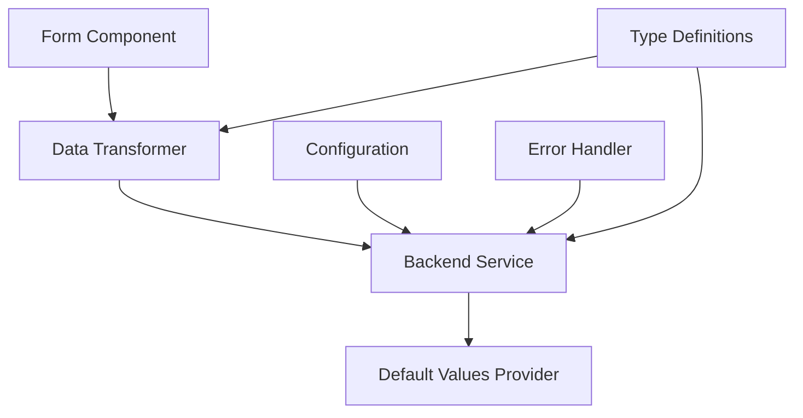

# Developer Guide: Extending the Backend Integration

This guide provides detailed information for developers who want to extend, modify, or contribute to the backend integration functionality.

## Table of Contents

- [Architecture Overview](#architecture-overview)
- [Extending Data Transformation](#extending-data-transformation)
- [Adding New Backend Endpoints](#adding-new-backend-endpoints)
- [Custom Error Handling](#custom-error-handling)
- [Testing Strategies](#testing-strategies)
- [Performance Optimization](#performance-optimization)
- [Security Considerations](#security-considerations)
- [Deployment Guidelines](#deployment-guidelines)
- [Contributing](#contributing)

## Architecture Overview

### Core Components

The backend integration consists of four main components:



### File Structure

```
src/lib/
├── dataTransformer.ts      # Data transformation logic
├── backendPdfService.ts    # API communication
├── defaultValues.ts        # Default value generation
├── config.ts              # Configuration management
├── types/
│   ├── backend.ts         # Backend type definitions
│   └── frontend.ts        # Frontend type definitions
└── utils/
    ├── errorHandler.ts    # Error handling utilities
    └── validation.ts      # Validation utilities
```

### Data Flow

1. **Form Submission** → `ItineraryForm.tsx`
2. **Data Transformation** → `dataTransformer.ts`
3. **API Request** → `backendPdfService.ts`
4. **Response Processing** → `backendPdfService.ts`
5. **File Download** → Browser download

## Extending Data Transformation

### Adding New Field Transformations

To add support for new fields in the data transformation:

#### 1. Update Type Definitions

```typescript
// src/lib/types/backend.ts
export interface ItineraryRequest {
  // ... existing fields
  newField: NewFieldType;
}

export interface NewFieldType {
  property1: string;
  property2: number;
  // ... other properties
}
```

#### 2. Extend Default Values

```typescript
// src/lib/defaultValues.ts
export interface NewFieldType {
  property1: string;
  property2: number;
}

export function getDefaultNewField(): NewFieldType {
  return {
    property1: "default value",
    property2: 0,
  };
}

// Update generateAllDefaults
export function generateAllDefaults() {
  return {
    // ... existing defaults
    newField: getDefaultNewField(),
  };
}
```

#### 3. Add Transformation Logic

```typescript
// src/lib/dataTransformer.ts
export function transformNewField(
  frontendData: ItineraryFormData
): NewFieldType {
  // Custom transformation logic
  return {
    property1: frontendData.someProperty || getDefaultNewField().property1,
    property2: calculateProperty2(frontendData),
  };
}

// Update main transformation function
export function transformToBackendFormat(
  frontendData: ItineraryFormData
): ItineraryRequest {
  const defaults = generateAllDefaults();

  return {
    // ... existing transformations
    newField: transformNewField(frontendData),
  };
}
```

#### 4. Add Validation

```typescript
// src/lib/dataTransformer.ts
export function validateTransformedData(data: ItineraryRequest): {
  isValid: boolean;
  errors: string[];
} {
  const errors: string[] = [];

  // ... existing validations

  // Validate new field
  if (!data.newField.property1) {
    errors.push("New field property1 is required");
  }

  if (data.newField.property2 < 0) {
    errors.push("New field property2 must be non-negative");
  }

  return {
    isValid: errors.length === 0,
    errors,
  };
}
```

### Creating Custom Transformation Functions

For complex transformations, create dedicated functions:

```typescript
// src/lib/transformers/customTransformer.ts
export class CustomTransformer {
  private config: TransformationConfig;

  constructor(config: TransformationConfig) {
    this.config = config;
  }

  public transform(input: CustomInput): CustomOutput {
    // Complex transformation logic
    return this.applyRules(input);
  }

  private applyRules(input: CustomInput): CustomOutput {
    // Rule-based transformation
    const rules = this.config.rules;

    return rules.reduce((output, rule) => {
      return rule.apply(output, input);
    }, this.getDefaultOutput());
  }

  private getDefaultOutput(): CustomOutput {
    return {
      // Default structure
    };
  }
}

// Usage in dataTransformer.ts
import { CustomTransformer } from "./transformers/customTransformer";

const customTransformer = new CustomTransformer(transformationConfig);
const customData = customTransformer.transform(frontendData.customField);
```

### Context-Aware Transformations

Create transformations that adapt based on context:

```typescript
// src/lib/transformers/contextAwareTransformer.ts
export class ContextAwareTransformer {
  public transformBasedOnDestination(
    data: ActivityData,
    destination: string
  ): TransformedActivity {
    const context = this.getDestinationContext(destination);

    return {
      ...data,
      type: this.determineActivityType(data, context),
      time: this.getOptimalTime(data.type, context),
      price: this.adjustPriceForRegion(data.price, context.currency),
    };
  }

  private getDestinationContext(destination: string): DestinationContext {
    const contexts: Record<string, DestinationContext> = {
      singapore: {
        timezone: "Asia/Singapore",
        currency: "SGD",
        commonActivityTypes: ["sightseeing", "dining", "shopping"],
        optimalTimes: { dining: "19:00", sightseeing: "09:00" },
      },
      thailand: {
        timezone: "Asia/Bangkok",
        currency: "THB",
        commonActivityTypes: ["cultural", "adventure", "leisure"],
        optimalTimes: { cultural: "08:00", adventure: "07:00" },
      },
    };

    return contexts[destination.toLowerCase()] || this.getDefaultContext();
  }
}
```

## Adding New Backend Endpoints

### 1. Define New Service Methods

```typescript
// src/lib/backendPdfService.ts
export class BackendPdfService {
  // ... existing methods

  /**
   * Generate itinerary summary (new endpoint)
   */
  public async generateSummary(data: SummaryRequest): Promise<SummaryResponse> {
    const url = `${this.config.baseUrl}/api/v1/generate-summary`;

    const response = await this.makeRequest(url, {
      method: "POST",
      body: JSON.stringify(data),
    });

    return this.handleJsonResponse<SummaryResponse>(response);
  }

  /**
   * Validate itinerary data (new endpoint)
   */
  public async validateItinerary(
    data: ItineraryRequest
  ): Promise<ValidationResult> {
    const url = `${this.config.baseUrl}/api/v1/validate-itinerary`;

    const response = await this.makeRequest(url, {
      method: "POST",
      body: JSON.stringify(data),
    });

    return this.handleJsonResponse<ValidationResult>(response);
  }

  /**
   * Get available templates (new endpoint)
   */
  public async getTemplates(): Promise<Template[]> {
    const url = `${this.config.baseUrl}/api/v1/templates`;

    const response = await this.makeRequest(url, {
      method: "GET",
    });

    return this.handleJsonResponse<Template[]>(response);
  }

  // Helper method for making requests
  private async makeRequest(
    url: string,
    options: RequestInit
  ): Promise<Response> {
    const controller = new AbortController();
    const timeoutId = setTimeout(() => controller.abort(), this.config.timeout);

    try {
      const response = await fetch(url, {
        ...options,
        headers: {
          "Content-Type": "application/json",
          Accept: "application/json",
          "User-Agent": "ItineraryApp/1.0",
          "X-Request-ID": this.generateRequestId(),
          ...options.headers,
        },
        signal: controller.signal,
      });

      clearTimeout(timeoutId);
      return response;
    } catch (error) {
      clearTimeout(timeoutId);
      throw this.handleRequestError(error);
    }
  }

  // Helper method for handling JSON responses
  private async handleJsonResponse<T>(response: Response): Promise<T> {
    if (!response.ok) {
      await this.handleErrorResponse(response, "application/json");
    }

    const data = await response.json();
    return data as T;
  }
}
```

### 2. Add Type Definitions

```typescript
// src/lib/types/backend.ts
export interface SummaryRequest {
  itinerary: ItineraryRequest;
  options: SummaryOptions;
}

export interface SummaryOptions {
  includeImages: boolean;
  format: "brief" | "detailed";
  language: string;
}

export interface SummaryResponse {
  summary: string;
  highlights: string[];
  duration: string;
  totalCost: number;
}

export interface ValidationResult {
  isValid: boolean;
  errors: ValidationError[];
  warnings: ValidationWarning[];
}

export interface Template {
  id: string;
  name: string;
  description: string;
  preview: string;
  category: string;
}
```

### 3. Create Service Wrapper

```typescript
// src/lib/services/itineraryService.ts
import { backendPdfService } from "../backendPdfService";

export class ItineraryService {
  /**
   * Complete itinerary processing workflow
   */
  public async processItinerary(
    frontendData: ItineraryFormData
  ): Promise<ProcessingResult> {
    // 1. Transform data
    const backendData = transformToBackendFormat(frontendData);

    // 2. Validate data
    const validation = await backendPdfService.validateItinerary(backendData);
    if (!validation.isValid) {
      throw new ValidationError(
        "Itinerary validation failed",
        validation.errors
      );
    }

    // 3. Generate summary
    const summary = await backendPdfService.generateSummary({
      itinerary: backendData,
      options: { includeImages: true, format: "detailed", language: "en" },
    });

    // 4. Generate PDF
    const pdfBlob = await backendPdfService.generatePDF(backendData);

    return {
      summary,
      pdfBlob,
      validation,
    };
  }

  /**
   * Get available PDF templates
   */
  public async getAvailableTemplates(): Promise<Template[]> {
    return backendPdfService.getTemplates();
  }
}

export const itineraryService = new ItineraryService();
```

### 4. Update Form Component

```typescript
// src/components/form/ItineraryForm.tsx
import { itineraryService } from "@/lib/services/itineraryService";

export function ItineraryForm() {
  const [templates, setTemplates] = useState<Template[]>([]);
  const [summary, setSummary] = useState<SummaryResponse | null>(null);

  // Load templates on component mount
  useEffect(() => {
    const loadTemplates = async () => {
      try {
        const availableTemplates =
          await itineraryService.getAvailableTemplates();
        setTemplates(availableTemplates);
      } catch (error) {
        console.error("Failed to load templates:", error);
      }
    };

    loadTemplates();
  }, []);

  // Enhanced PDF generation with summary
  const handleEnhancedPdfGeneration = async (data: ItineraryFormData) => {
    try {
      setIsGenerating(true);

      const result = await itineraryService.processItinerary(data);

      setSummary(result.summary);

      const filename = generateFilename({
        destination: data.destination,
        customerName: data.customerName,
        startDate: data.startDate,
      });

      downloadPdf(result.pdfBlob, filename);
    } catch (error) {
      handleError(error);
    } finally {
      setIsGenerating(false);
    }
  };

  // ... rest of component
}
```

## Custom Error Handling

### Creating Custom Error Types

```typescript
// src/lib/errors/customErrors.ts
export class ItineraryError extends Error {
  constructor(message: string, public code: string, public context?: any) {
    super(message);
    this.name = "ItineraryError";
  }
}

export class TransformationError extends ItineraryError {
  constructor(message: string, public field: string, public value: any) {
    super(message, "TRANSFORMATION_ERROR", { field, value });
    this.name = "TransformationError";
  }
}

export class ValidationError extends ItineraryError {
  constructor(message: string, public errors: ValidationErrorDetail[]) {
    super(message, "VALIDATION_ERROR", { errors });
    this.name = "ValidationError";
  }
}
```

### Error Handler Service

```typescript
// src/lib/services/errorHandler.ts
export class ErrorHandlerService {
  private errorReporters: ErrorReporter[] = [];

  public addReporter(reporter: ErrorReporter): void {
    this.errorReporters.push(reporter);
  }

  public async handleError(
    error: Error,
    context?: ErrorContext
  ): Promise<void> {
    const errorInfo = this.categorizeError(error);

    // Log error
    console.error(`[${errorInfo.category}] ${error.message}`, {
      error,
      context,
      stack: error.stack,
    });

    // Report to external services
    await Promise.all(
      this.errorReporters.map((reporter) =>
        reporter.report(errorInfo, context).catch(console.error)
      )
    );

    // Show user-friendly message
    this.showUserMessage(errorInfo);
  }

  private categorizeError(error: Error): ErrorInfo {
    if (error instanceof NetworkError) {
      return {
        category: "network",
        severity: "high",
        userMessage:
          "Connection problem. Please check your internet connection.",
        suggestedAction: "retry",
      };
    }

    if (error instanceof ValidationError) {
      return {
        category: "validation",
        severity: "medium",
        userMessage: "Please check your form data and try again.",
        suggestedAction: "fix_data",
      };
    }

    // ... other error types

    return {
      category: "unknown",
      severity: "high",
      userMessage: "An unexpected error occurred.",
      suggestedAction: "contact_support",
    };
  }

  private showUserMessage(errorInfo: ErrorInfo): void {
    // Show toast notification, modal, or other UI feedback
    toast.error(errorInfo.userMessage, {
      action: this.getActionButton(errorInfo.suggestedAction),
    });
  }
}
```

### Recovery Mechanisms

```typescript
// src/lib/services/errorRecovery.ts
export class ErrorRecoveryService {
  public async attemptRecovery<T>(
    error: Error,
    operation: () => Promise<T>,
    options: RecoveryOptions = {}
  ): Promise<T> {
    const { maxAttempts = 3, delay = 1000, backoff = 2 } = options;

    if (this.isRecoverable(error)) {
      for (let attempt = 1; attempt <= maxAttempts; attempt++) {
        try {
          await this.delay(delay * Math.pow(backoff, attempt - 1));
          return await operation();
        } catch (retryError) {
          if (attempt === maxAttempts) {
            throw retryError;
          }
          console.warn(`Recovery attempt ${attempt} failed:`, retryError);
        }
      }
    }

    throw error;
  }

  private isRecoverable(error: Error): boolean {
    // Network errors are usually recoverable
    if (error instanceof NetworkError) {
      return true;
    }

    // Server errors (5xx) might be recoverable
    if (error instanceof ServerError && error.statusCode >= 500) {
      return true;
    }

    // Timeout errors are recoverable
    if (error.message.includes("timeout")) {
      return true;
    }

    return false;
  }

  private delay(ms: number): Promise<void> {
    return new Promise((resolve) => setTimeout(resolve, ms));
  }
}
```

## Testing Strategies

### Unit Testing

```typescript
// src/lib/__tests__/dataTransformer.test.ts
import {
  transformToBackendFormat,
  validateTransformedData,
} from "../dataTransformer";
import { mockFrontendData } from "./mocks/frontendData";

describe("Data Transformer", () => {
  describe("transformToBackendFormat", () => {
    it("should transform customer data correctly", () => {
      const result = transformToBackendFormat(mockFrontendData);

      expect(result.customer).toEqual({
        name: mockFrontendData.customerName,
        email: mockFrontendData.customerEmail,
        phone: mockFrontendData.customerPhone,
      });
    });

    it("should calculate trip duration correctly", () => {
      const testData = {
        ...mockFrontendData,
        startDate: "2024-06-01",
        endDate: "2024-06-05",
      };

      const result = transformToBackendFormat(testData);

      expect(result.trip.duration).toBe("5 Days 4 Nights");
    });

    it("should handle empty activities array", () => {
      const testData = {
        ...mockFrontendData,
        days: [
          {
            dayNumber: 1,
            date: "2024-06-01",
            activities: [],
            transfers: [],
            flights: [],
          },
        ],
      };

      const result = transformToBackendFormat(testData);

      expect(result.itinerary.days[0].activities).toEqual([]);
      expect(result.itinerary.days[0].title).toBe("Day 1");
    });
  });

  describe("validateTransformedData", () => {
    it("should validate correct data", () => {
      const validData = transformToBackendFormat(mockFrontendData);
      const validation = validateTransformedData(validData);

      expect(validation.isValid).toBe(true);
      expect(validation.errors).toEqual([]);
    });

    it("should detect missing customer name", () => {
      const invalidData = transformToBackendFormat({
        ...mockFrontendData,
        customerName: "",
      });

      const validation = validateTransformedData(invalidData);

      expect(validation.isValid).toBe(false);
      expect(validation.errors).toContain("Customer name is required");
    });
  });
});
```

### Integration Testing

```typescript
// src/lib/__tests__/backendPdfService.integration.test.ts
import { backendPdfService } from "../backendPdfService";
import { transformToBackendFormat } from "../dataTransformer";
import { mockFrontendData } from "./mocks/frontendData";

describe("Backend PDF Service Integration", () => {
  beforeAll(() => {
    // Setup test environment
    process.env.NEXT_PUBLIC_BACKEND_URL = "http://localhost:8081";
    process.env.NEXT_PUBLIC_ENABLE_BACKEND_PDF = "true";
  });

  it("should generate PDF successfully", async () => {
    const backendData = transformToBackendFormat(mockFrontendData);

    const pdfBlob = await backendPdfService.generatePDF(backendData);

    expect(pdfBlob).toBeInstanceOf(Blob);
    expect(pdfBlob.size).toBeGreaterThan(0);
    expect(pdfBlob.type).toBe("application/pdf");
  }, 30000); // 30 second timeout

  it("should handle backend errors gracefully", async () => {
    const invalidData = { invalid: "data" } as any;

    await expect(backendPdfService.generatePDF(invalidData)).rejects.toThrow(
      ValidationError
    );
  });

  it("should check backend health", async () => {
    const health = await backendPdfService.checkBackendHealth();

    expect(health).toHaveProperty("isHealthy");
    expect(health).toHaveProperty("responseTime");

    if (health.isHealthy) {
      expect(health.responseTime).toBeGreaterThan(0);
    } else {
      expect(health).toHaveProperty("error");
    }
  });
});
```

### End-to-End Testing

```typescript
// e2e/backend-integration.spec.ts
import { test, expect } from "@playwright/test";

test.describe("Backend Integration E2E", () => {
  test("should generate PDF using backend", async ({ page }) => {
    // Navigate to form
    await page.goto("/");

    // Fill form
    await page.fill('[data-testid="customer-name"]', "John Doe");
    await page.fill('[data-testid="customer-email"]', "john@example.com");
    await page.fill('[data-testid="customer-phone"]', "+1234567890");
    await page.fill('[data-testid="trip-title"]', "Test Trip");
    await page.fill('[data-testid="destination"]', "Singapore");
    await page.fill('[data-testid="start-date"]', "2024-06-01");
    await page.fill('[data-testid="end-date"]', "2024-06-05");
    await page.fill('[data-testid="travelers"]', "2");

    // Add activity
    await page.click('[data-testid="add-activity"]');
    await page.fill('[data-testid="activity-name-0"]', "Marina Bay Sands");
    await page.fill('[data-testid="activity-location-0"]', "Marina Bay");

    // Generate PDF using backend
    const downloadPromise = page.waitForEvent("download");
    await page.click('[data-testid="generate-backend-pdf"]');

    // Wait for download
    const download = await downloadPromise;
    expect(download.suggestedFilename()).toMatch(/\.pdf$/);

    // Verify success message
    await expect(page.locator('[data-testid="success-message"]')).toContainText(
      "PDF generated successfully"
    );
  });

  test("should fallback to client-side on backend failure", async ({
    page,
  }) => {
    // Mock backend failure
    await page.route("**/api/v1/generate-pdf", (route) => {
      route.fulfill({ status: 500, body: "Server Error" });
    });

    // ... fill form (same as above)

    // Try backend generation
    await page.click('[data-testid="generate-backend-pdf"]');

    // Should show error and fallback suggestion
    await expect(page.locator('[data-testid="error-message"]')).toContainText(
      "Backend PDF generation failed"
    );

    await expect(
      page.locator('[data-testid="fallback-suggestion"]')
    ).toContainText("Try client-side generation");
  });
});
```

### Mock Data

```typescript
// src/lib/__tests__/mocks/frontendData.ts
export const mockFrontendData: ItineraryFormData = {
  customerName: "John Doe",
  customerEmail: "john.doe@example.com",
  customerPhone: "+1-555-0123",
  tripTitle: "Singapore Adventure",
  destination: "Singapore",
  startDate: "2024-06-01",
  endDate: "2024-06-05",
  numberOfTravellers: 2,
  days: [
    {
      dayNumber: 1,
      date: "2024-06-01",
      activities: [
        {
          id: "act1",
          name: "Marina Bay Sands",
          description: "Iconic hotel and observation deck",
          location: "Marina Bay",
          duration: "2 hours",
          price: 25,
          image: "https://example.com/marina-bay.jpg",
        },
      ],
      transfers: [
        {
          id: "trans1",
          type: "Airport Transfer",
          from: "Changi Airport",
          to: "Marina Bay Hotel",
          pickupTime: "14:00",
          dropoffTime: "15:00",
          duration: "45 minutes",
          price: 35,
          capacity: 4,
        },
      ],
      flights: [
        {
          id: "flight1",
          airline: "Singapore Airlines",
          flightNumber: "SQ401",
          from: "DEL",
          to: "SIN",
          departure: "08:30",
          arrival: "16:45",
          class: "Economy",
          price: 650,
        },
      ],
    },
  ],
};

export const mockBackendData = transformToBackendFormat(mockFrontendData);
```

## Performance Optimization

### Lazy Loading

```typescript
// src/lib/services/lazyBackendService.ts
export class LazyBackendService {
  private servicePromise: Promise<BackendPdfService> | null = null;

  public async getService(): Promise<BackendPdfService> {
    if (!this.servicePromise) {
      this.servicePromise = this.loadService();
    }
    return this.servicePromise;
  }

  private async loadService(): Promise<BackendPdfService> {
    // Lazy load the service and its dependencies
    const { BackendPdfService } = await import("../backendPdfService");
    return new BackendPdfService();
  }
}

export const lazyBackendService = new LazyBackendService();
```

### Caching

```typescript
// src/lib/services/cacheService.ts
export class CacheService {
  private cache = new Map<string, CacheEntry>();
  private readonly TTL = 5 * 60 * 1000; // 5 minutes

  public async get<T>(key: string, fetcher: () => Promise<T>): Promise<T> {
    const cached = this.cache.get(key);

    if (cached && Date.now() - cached.timestamp < this.TTL) {
      return cached.data as T;
    }

    const data = await fetcher();
    this.cache.set(key, { data, timestamp: Date.now() });

    return data;
  }

  public invalidate(key: string): void {
    this.cache.delete(key);
  }

  public clear(): void {
    this.cache.clear();
  }
}

// Usage
const cacheService = new CacheService();

export async function getCachedTemplates(): Promise<Template[]> {
  return cacheService.get("templates", () => backendPdfService.getTemplates());
}
```

### Request Batching

```typescript
// src/lib/services/batchService.ts
export class BatchService {
  private pendingRequests = new Map<string, Promise<any>>();

  public async batchRequest<T>(
    key: string,
    request: () => Promise<T>
  ): Promise<T> {
    if (this.pendingRequests.has(key)) {
      return this.pendingRequests.get(key) as Promise<T>;
    }

    const promise = request().finally(() => {
      this.pendingRequests.delete(key);
    });

    this.pendingRequests.set(key, promise);
    return promise;
  }
}

// Usage
const batchService = new BatchService();

export async function generatePDFBatched(
  data: ItineraryRequest
): Promise<Blob> {
  const key = `pdf-${JSON.stringify(data).slice(0, 100)}`;
  return batchService.batchRequest(key, () =>
    backendPdfService.generatePDF(data)
  );
}
```

## Security Considerations

### Input Sanitization

```typescript
// src/lib/security/sanitizer.ts
export class DataSanitizer {
  public sanitizeItineraryData(data: ItineraryFormData): ItineraryFormData {
    return {
      ...data,
      customerName: this.sanitizeString(data.customerName),
      customerEmail: this.sanitizeEmail(data.customerEmail),
      customerPhone: this.sanitizePhone(data.customerPhone),
      tripTitle: this.sanitizeString(data.tripTitle),
      destination: this.sanitizeString(data.destination),
      days: data.days.map((day) => this.sanitizeDay(day)),
    };
  }

  private sanitizeString(input: string): string {
    return input
      .trim()
      .replace(/<script\b[^<]*(?:(?!<\/script>)<[^<]*)*<\/script>/gi, "")
      .replace(/[<>]/g, "");
  }

  private sanitizeEmail(email: string): string {
    const emailRegex = /^[^\s@]+@[^\s@]+\.[^\s@]+$/;
    const sanitized = this.sanitizeString(email);
    return emailRegex.test(sanitized) ? sanitized : "";
  }

  private sanitizePhone(phone: string): string {
    return phone.replace(/[^+\d\s\-()]/g, "");
  }

  private sanitizeDay(day: any): any {
    return {
      ...day,
      activities:
        day.activities?.map((activity: any) => ({
          ...activity,
          name: this.sanitizeString(activity.name),
          description: this.sanitizeString(activity.description),
          location: this.sanitizeString(activity.location),
        })) || [],
    };
  }
}
```

### Request Validation

```typescript
// src/lib/security/validator.ts
export class RequestValidator {
  public validateItineraryRequest(data: ItineraryRequest): ValidationResult {
    const errors: string[] = [];

    // Validate required fields
    if (!this.isValidString(data.customer.name)) {
      errors.push("Invalid customer name");
    }

    if (!this.isValidEmail(data.customer.email)) {
      errors.push("Invalid customer email");
    }

    // Validate data sizes
    if (JSON.stringify(data).length > 1024 * 1024) {
      // 1MB limit
      errors.push("Request data too large");
    }

    // Validate arrays
    if (data.itinerary.days.length > 30) {
      errors.push("Too many days in itinerary");
    }

    return {
      isValid: errors.length === 0,
      errors,
    };
  }

  private isValidString(str: string): boolean {
    return (
      typeof str === "string" && str.trim().length > 0 && str.length < 1000
    );
  }

  private isValidEmail(email: string): boolean {
    const emailRegex = /^[^\s@]+@[^\s@]+\.[^\s@]+$/;
    return emailRegex.test(email) && email.length < 255;
  }
}
```

## Deployment Guidelines

### Environment Configuration

```typescript
// src/lib/config/deployment.ts
export class DeploymentConfig {
  public static getConfig(): DeploymentConfiguration {
    const env = process.env.NODE_ENV || "development";

    const configs: Record<string, DeploymentConfiguration> = {
      development: {
        backendUrl: "http://localhost:8080",
        timeout: 30000,
        retries: 3,
        enableDebug: true,
        enableErrorReporting: false,
      },
      staging: {
        backendUrl:
          process.env.NEXT_PUBLIC_BACKEND_URL ||
          "https://api-staging.example.com",
        timeout: 45000,
        retries: 5,
        enableDebug: true,
        enableErrorReporting: true,
      },
      production: {
        backendUrl: process.env.NEXT_PUBLIC_BACKEND_URL!,
        timeout: 60000,
        retries: 3,
        enableDebug: false,
        enableErrorReporting: true,
      },
    };

    const config = configs[env];

    if (!config) {
      throw new Error(`Unknown environment: ${env}`);
    }

    if (env === "production" && !config.backendUrl) {
      throw new Error("Backend URL is required in production");
    }

    return config;
  }
}
```

### Health Checks

```typescript
// src/lib/monitoring/healthCheck.ts
export class HealthCheckService {
  public async performHealthCheck(): Promise<HealthStatus> {
    const checks = await Promise.allSettled([
      this.checkBackendConnectivity(),
      this.checkDatabaseConnection(),
      this.checkExternalServices(),
    ]);

    const results = checks.map((check, index) => ({
      name: ["backend", "database", "external"][index],
      status: check.status === "fulfilled" ? "healthy" : "unhealthy",
      details: check.status === "fulfilled" ? check.value : check.reason,
    }));

    const overallStatus = results.every((r) => r.status === "healthy")
      ? "healthy"
      : "unhealthy";

    return {
      status: overallStatus,
      timestamp: new Date().toISOString(),
      checks: results,
    };
  }

  private async checkBackendConnectivity(): Promise<any> {
    return backendPdfService.checkBackendHealth();
  }

  private async checkDatabaseConnection(): Promise<any> {
    // Database health check logic
    return { connected: true };
  }

  private async checkExternalServices(): Promise<any> {
    // External service health checks
    return { services: [] };
  }
}
```

## Contributing

### Code Style

Follow these conventions when contributing:

1. **TypeScript**: Use strict TypeScript with proper type definitions
2. **Naming**: Use descriptive names for functions and variables
3. **Comments**: Document complex logic and public APIs
4. **Error Handling**: Always handle errors gracefully
5. **Testing**: Write tests for new functionality

### Pull Request Process

1. **Fork** the repository
2. **Create** a feature branch
3. **Write** tests for your changes
4. **Ensure** all tests pass
5. **Update** documentation
6. **Submit** pull request

### Development Setup

```bash
# Clone repository
git clone <repository-url>
cd itinerary-app

# Install dependencies
npm install

# Start development server
npm run dev

# Run tests
npm test

# Run type checking
npm run type-check

# Run linting
npm run lint
```

### Testing Your Changes

```bash
# Unit tests
npm run test:unit

# Integration tests
npm run test:integration

# E2E tests
npm run test:e2e

# All tests
npm run test:all
```

This developer guide provides the foundation for extending and maintaining the backend integration functionality. For specific implementation details, refer to the existing code and type definitions.
